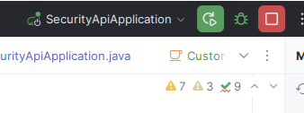

# 📄 Secure BookStore Project

A full-stack web application for managing and purchasing books online, implemented with:

- ✅ Spring Boot (Backend)
- ✅ Thymeleaf (Frontend)
- ✅ MySQL (Database)
- ✅ Bootstrap (UI styling)

> **Course**: COMP47910 - Secure Software Engineering  
> **Program**: MSc in Advanced Software Engineering  
> **Semester**: Summer 2024/25  
> **University College Dublin (UCD)**  
> 

### ✅ **IMFA & Email (SMTP) setup:  see [SMTP.md](SMTP.md) for the special configuration required to enable email-based 2FA (MFA).**

### ✅ **Important: Default Admin Credentials**
> 🛂 **Predefined Admin User**  
> After setting up the database, you can access the admin dashboard using:
> - 👤 **Username**: `admin`
> - 🔒 **Password**: `admin`


## ⚙️ Technologies Used

| Tool / Library          | Purpose                        |
| ----------------------- | ------------------------------ |
| ☕ Java 21 (OpenJDK)     | Language and runtime platform  |
| 🧰 Spring Boot 3.5.0    | Backend development framework  |
| 📝 Thymeleaf            | Server-side template engine    |
| 🛢 MySQL                | Relational database            |
| 🎨 Bootstrap 5.3.3      | CSS styling                    |
| 🌟 Font Awesome 6.7.2   | Icons                          |
| 📦 WebJars              | Frontend dependency delivery   |
| 🔐 Spring Security      | Basic access/session protection |

---

## 🛠️ Installation & Setup (Beginner Friendly)

### ✅ Step 1: Install Java 21 (OpenJDK)

1.
[jdk.java.net](https://jdk.java.net/21/)  Superseded

[Adoptium (Temurin)](https://adoptium.net/) **Recommended**: Actively maintained

[Amazon Corretto](https://docs.aws.amazon.com/corretto/latest/corretto-21-ug/downloads-list.html)


2. Download the correct installer for your OS (Windows/Linux/macOS).

3. **Extract or Install** the JDK, then set environment variables:

#### ✅ On Windows:

- Open *System Properties → Environment Variables*
- Under **System Variables**, click **New**:
    - **Name**: `JAVA_HOME`
    - **Value**: `C:\Program Files\Java\jdk-21` (adjust based on your path)
- Edit `Path` → Add:  
  `%JAVA_HOME%\bin`

Then confirm via terminal:

```bash
java -version
```

Should return something like:  
`java 21 2023-09-19` ✔️

---

### ✅ Step 2: Clone the Repository

```bash
git clone https://github.com/kyriakidisdimitrios/securityApi.git
cd securityApi
```

---

### ✅ Step 3: Install & Configure MySQL
## ⚠️ Important

**‼️ When running the program from IntelliJ, make sure `SecurityApiApplication` is selected!**



1. Install MySQL from:  
   👉 [https://dev.mysql.com/downloads/installer/](https://dev.mysql.com/downloads/installer/)

2. Create a new database:

```sql
CREATE DATABASE IF NOT EXISTS securityapi;
USE securityapi;

-- Verify current database
SELECT DATABASE();
```

Typical MySQL commands:
2a.
Delete entires:
```sql

SET SQL_SAFE_UPDATES = 0;
DELETE FROM securityapi.cart_items;
DELETE FROM securityapi.book_authors;
DELETE FROM securityapi.books;
DELETE FROM securityapi.authors;
DELETE FROM securityapi.customers;
SET SQL_SAFE_UPDATES = 1;

-- Reset auto-increment counters
ALTER TABLE securityapi.cart_items AUTO_INCREMENT = 1;
ALTER TABLE securityapi.book_authors AUTO_INCREMENT = 1;
ALTER TABLE securityapi.books AUTO_INCREMENT = 1;
ALTER TABLE securityapi.authors AUTO_INCREMENT = 1;
ALTER TABLE securityapi.customers AUTO_INCREMENT = 1;

```
2b. 
```sql
--CWE-250:
-- Create the user with your desired password. application.properties should have the same password.
CREATE USER 'jimboy3100'@'%' IDENTIFIED BY 'Jimboy31';
-- Grant only the minimal privileges required by the application
GRANT SELECT, INSERT, UPDATE, DELETE ON securityapi.* TO 'jimboy3100'@'%';
-- Apply changes
FLUSH PRIVILEGES; 
```
2c. Add a customer with privilege admin having username `admin` and password `admin`, and populate tables books, authors and book_authors.
```sql
-- 🧑‍💼CREATE ADMIN. USERNAME: admin PASSWORD: admin
-- IMPORTANT NOTE: Run the program first in order to create the tables first.
-- Note: First create the admin (hit commit), and the the other commands. It might cause "Error Code: 1054. Unknown column 'dateOfBirth' in 'field list'".
-- Fixing needs to adjust date of birth to proper birth that MySQL needs. For me it is YYYY-MM-DD.
INSERT INTO securityapi.customers (
    username, name, surname, date_of_birth, address, phone_number, email, password, is_admin
) VALUES ('admin', 'Admin', 'User', '2000-01-01', 'System Address', '0000000000', 'admin@system.com','$2a$10$8so23zwzKEneish54WAGg.jY0g4r6t12XgEtWpUmgQUnkFaVYMZA.',  -- correct hashed "admin"true);

-- 🧑‍💼 AUTHORS

INSERT INTO securityapi.authors (first_name, last_name) VALUES ('J.R.R.', 'Tolkien');
INSERT INTO securityapi.authors (first_name, last_name) VALUES ('George R.R.', 'Martin');
INSERT INTO securityapi.authors (first_name, last_name) VALUES ('J.K.', 'Rowling');
INSERT INTO securityapi.authors (first_name, last_name) VALUES ('Stephen', 'King');
INSERT INTO securityapi.authors (first_name, last_name) VALUES ('Agatha', 'Christie');
INSERT INTO securityapi.authors (first_name, last_name) VALUES ('Isaac', 'Asimov');
INSERT INTO securityapi.authors (first_name, last_name) VALUES ('Arthur C.', 'Clarke');
INSERT INTO securityapi.authors (first_name, last_name) VALUES ('Dan', 'Brown');
INSERT INTO securityapi.authors (first_name, last_name) VALUES ('Jane', 'Austen');
INSERT INTO securityapi.authors (first_name, last_name) VALUES ('Mark', 'Twain');

-- 📚 BOOKS

INSERT INTO securityapi.books (title, year, price, copies) VALUES ('The Hobbit', 1937, 18.99, 10);
INSERT INTO securityapi.books (title, year, price, copies) VALUES ('A Game of Thrones', 1996, 22.5, 8);
INSERT INTO securityapi.books (title, year, price, copies) VALUES ('Harry Potter and the Philosopher Stone', 1997, 20.0, 12);
INSERT INTO securityapi.books (title, year, price, copies) VALUES ('It', 1986, 19.95, 6);
INSERT INTO securityapi.books (title, year, price, copies) VALUES ('Murder on the Orient Express', 1934, 14.5, 9);
INSERT INTO securityapi.books (title, year, price, copies) VALUES ('Foundation', 1951, 17.75, 11);
INSERT INTO securityapi.books (title, year, price, copies) VALUES ('2001: A Space Odyssey', 1968, 16.8, 7);
INSERT INTO securityapi.books (title, year, price, copies) VALUES ('The Da Vinci Code', 2003, 21.6, 10);
INSERT INTO securityapi.books (title, year, price, copies) VALUES ('Pride and Prejudice', 1813, 13.4, 8);
INSERT INTO securityapi.books (title, year, price, copies) VALUES ('Adventures of Huckleberry Finn', 1884, 15.0, 6);
INSERT INTO securityapi.books (title, year, price, copies) VALUES ('Collaborative Tales', 2024, 25.0, 5);

-- 🔗 BOOK-AUTHOR RELATIONSHIPS

INSERT INTO securityapi.book_authors (book_id, author_id)
VALUES ((SELECT id FROM securityapi.books WHERE title = 'The Hobbit' LIMIT 1),
        (SELECT id FROM securityapi.authors WHERE first_name = 'J.R.R.' AND last_name = 'Tolkien' LIMIT 1));

INSERT INTO securityapi.book_authors (book_id, author_id)
VALUES ((SELECT id FROM securityapi.books WHERE title = 'A Game of Thrones' LIMIT 1),
        (SELECT id FROM securityapi.authors WHERE first_name = 'George R.R.' AND last_name = 'Martin' LIMIT 1));

INSERT INTO securityapi.book_authors (book_id, author_id)
VALUES ((SELECT id FROM securityapi.books WHERE title = 'Harry Potter and the Philosopher Stone' LIMIT 1),
        (SELECT id FROM securityapi.authors WHERE first_name = 'J.K.' AND last_name = 'Rowling' LIMIT 1));

INSERT INTO securityapi.book_authors (book_id, author_id)
VALUES ((SELECT id FROM securityapi.books WHERE title = 'It' LIMIT 1),
        (SELECT id FROM securityapi.authors WHERE first_name = 'Stephen' AND last_name = 'King' LIMIT 1));

INSERT INTO securityapi.book_authors (book_id, author_id)
VALUES ((SELECT id FROM securityapi.books WHERE title = 'Murder on the Orient Express' LIMIT 1),
        (SELECT id FROM securityapi.authors WHERE first_name = 'Agatha' AND last_name = 'Christie' LIMIT 1));

INSERT INTO securityapi.book_authors (book_id, author_id)
VALUES ((SELECT id FROM securityapi.books WHERE title = 'Foundation' LIMIT 1),
        (SELECT id FROM securityapi.authors WHERE first_name = 'Isaac' AND last_name = 'Asimov' LIMIT 1));

INSERT INTO securityapi.book_authors (book_id, author_id)
VALUES ((SELECT id FROM securityapi.books WHERE title = '2001: A Space Odyssey' LIMIT 1),
        (SELECT id FROM securityapi.authors WHERE first_name = 'Arthur C.' AND last_name = 'Clarke' LIMIT 1));

INSERT INTO securityapi.book_authors (book_id, author_id)
VALUES ((SELECT id FROM securityapi.books WHERE title = 'The Da Vinci Code' LIMIT 1),
        (SELECT id FROM securityapi.authors WHERE first_name = 'Dan' AND last_name = 'Brown' LIMIT 1));

INSERT INTO securityapi.book_authors (book_id, author_id)
VALUES ((SELECT id FROM securityapi.books WHERE title = 'Pride and Prejudice' LIMIT 1),
        (SELECT id FROM securityapi.authors WHERE first_name = 'Jane' AND last_name = 'Austen' LIMIT 1));

INSERT INTO securityapi.book_authors (book_id, author_id)
VALUES ((SELECT id FROM securityapi.books WHERE title = 'Adventures of Huckleberry Finn' LIMIT 1),
        (SELECT id FROM securityapi.authors WHERE first_name = 'Mark' AND last_name = 'Twain' LIMIT 1));

-- 📘 Collaborative book with two authors
INSERT INTO securityapi.book_authors (book_id, author_id)
VALUES ((SELECT id FROM securityapi.books WHERE title = 'Collaborative Tales' LIMIT 1),
        (SELECT id FROM securityapi.authors WHERE first_name = 'J.R.R.' AND last_name = 'Tolkien' LIMIT 1));
INSERT INTO securityapi.book_authors (book_id, author_id)
VALUES ((SELECT id FROM securityapi.books WHERE title = 'Collaborative Tales' LIMIT 1),
        (SELECT id FROM securityapi.authors WHERE first_name = 'George R.R.' AND last_name = 'Martin' LIMIT 1));

SET SQL_SAFE_UPDATES = 0;
DELETE FROM securityapi.cart_items;
DELETE FROM securityapi.book_authors;
DELETE FROM securityapi.books;
DELETE FROM securityapi.authors;
DELETE FROM securityapi.customers;
SET SQL_SAFE_UPDATES = 1;

-- Reset auto-increment counters
ALTER TABLE securityapi.cart_items AUTO_INCREMENT = 1;
ALTER TABLE securityapi.book_authors AUTO_INCREMENT = 1;
ALTER TABLE securityapi.books AUTO_INCREMENT = 1;
ALTER TABLE securityapi.authors AUTO_INCREMENT = 1;
ALTER TABLE securityapi.customers AUTO_INCREMENT = 1;
```

2b. Add a customer with privilege admin having username `admin` and password `admin`, and populate tables books, authors and book_authors.
```sql
-- IMPORTANT NOTE: Run the program first in order to create the tables first.

-- Note: First create the admin (hit commit), and the the other commands. It might cause "Error Code: 1054. Unknown column 'dateOfBirth' in 'field list'".
-- Fixing needs to adjust date of birth to proper birth that MySQL needs. For me it is YYYY-MM-DD.

-- 🧑‍💼CREATE ADMIN. USERNAME: admin PASSWORD: admin

INSERT INTO securityapi.customers (
    username, name, surname, date_of_birth, address, phone_number, email, password, is_admin
) VALUES ('admin', 'Admin', 'User', '2000-01-01', 'System Address', '0000000000', 'admin@system.com','$2a$10$8so23zwzKEneish54WAGg.jY0g4r6t12XgEtWpUmgQUnkFaVYMZA.',  -- correct hashed "admin"true);

-- 🧑‍💼 AUTHORS

INSERT INTO securityapi.authors (first_name, last_name) VALUES ('J.R.R.', 'Tolkien');
INSERT INTO securityapi.authors (first_name, last_name) VALUES ('George R.R.', 'Martin');
INSERT INTO securityapi.authors (first_name, last_name) VALUES ('J.K.', 'Rowling');
INSERT INTO securityapi.authors (first_name, last_name) VALUES ('Stephen', 'King');
INSERT INTO securityapi.authors (first_name, last_name) VALUES ('Agatha', 'Christie');
INSERT INTO securityapi.authors (first_name, last_name) VALUES ('Isaac', 'Asimov');
INSERT INTO securityapi.authors (first_name, last_name) VALUES ('Arthur C.', 'Clarke');
INSERT INTO securityapi.authors (first_name, last_name) VALUES ('Dan', 'Brown');
INSERT INTO securityapi.authors (first_name, last_name) VALUES ('Jane', 'Austen');
INSERT INTO securityapi.authors (first_name, last_name) VALUES ('Mark', 'Twain');

-- 📚 BOOKS

INSERT INTO securityapi.books (title, year, price, copies) VALUES ('The Hobbit', 1937, 18.99, 10);
INSERT INTO securityapi.books (title, year, price, copies) VALUES ('A Game of Thrones', 1996, 22.5, 8);
INSERT INTO securityapi.books (title, year, price, copies) VALUES ('Harry Potter and the Philosopher Stone', 1997, 20.0, 12);
INSERT INTO securityapi.books (title, year, price, copies) VALUES ('It', 1986, 19.95, 6);
INSERT INTO securityapi.books (title, year, price, copies) VALUES ('Murder on the Orient Express', 1934, 14.5, 9);
INSERT INTO securityapi.books (title, year, price, copies) VALUES ('Foundation', 1951, 17.75, 11);
INSERT INTO securityapi.books (title, year, price, copies) VALUES ('2001: A Space Odyssey', 1968, 16.8, 7);
INSERT INTO securityapi.books (title, year, price, copies) VALUES ('The Da Vinci Code', 2003, 21.6, 10);
INSERT INTO securityapi.books (title, year, price, copies) VALUES ('Pride and Prejudice', 1813, 13.4, 8);
INSERT INTO securityapi.books (title, year, price, copies) VALUES ('Adventures of Huckleberry Finn', 1884, 15.0, 6);
INSERT INTO securityapi.books (title, year, price, copies) VALUES ('Collaborative Tales', 2024, 25.0, 5);

-- 🔗 BOOK-AUTHOR RELATIONSHIPS

INSERT INTO securityapi.book_authors (book_id, author_id)
VALUES ((SELECT id FROM securityapi.books WHERE title = 'The Hobbit' LIMIT 1),
        (SELECT id FROM securityapi.authors WHERE first_name = 'J.R.R.' AND last_name = 'Tolkien' LIMIT 1));

INSERT INTO securityapi.book_authors (book_id, author_id)
VALUES ((SELECT id FROM securityapi.books WHERE title = 'A Game of Thrones' LIMIT 1),
        (SELECT id FROM securityapi.authors WHERE first_name = 'George R.R.' AND last_name = 'Martin' LIMIT 1));

INSERT INTO securityapi.book_authors (book_id, author_id)
VALUES ((SELECT id FROM securityapi.books WHERE title = 'Harry Potter and the Philosopher Stone' LIMIT 1),
        (SELECT id FROM securityapi.authors WHERE first_name = 'J.K.' AND last_name = 'Rowling' LIMIT 1));

INSERT INTO securityapi.book_authors (book_id, author_id)
VALUES ((SELECT id FROM securityapi.books WHERE title = 'It' LIMIT 1),
        (SELECT id FROM securityapi.authors WHERE first_name = 'Stephen' AND last_name = 'King' LIMIT 1));

INSERT INTO securityapi.book_authors (book_id, author_id)
VALUES ((SELECT id FROM securityapi.books WHERE title = 'Murder on the Orient Express' LIMIT 1),
        (SELECT id FROM securityapi.authors WHERE first_name = 'Agatha' AND last_name = 'Christie' LIMIT 1));

INSERT INTO securityapi.book_authors (book_id, author_id)
VALUES ((SELECT id FROM securityapi.books WHERE title = 'Foundation' LIMIT 1),
        (SELECT id FROM securityapi.authors WHERE first_name = 'Isaac' AND last_name = 'Asimov' LIMIT 1));

INSERT INTO securityapi.book_authors (book_id, author_id)
VALUES ((SELECT id FROM securityapi.books WHERE title = '2001: A Space Odyssey' LIMIT 1),
        (SELECT id FROM securityapi.authors WHERE first_name = 'Arthur C.' AND last_name = 'Clarke' LIMIT 1));

INSERT INTO securityapi.book_authors (book_id, author_id)
VALUES ((SELECT id FROM securityapi.books WHERE title = 'The Da Vinci Code' LIMIT 1),
        (SELECT id FROM securityapi.authors WHERE first_name = 'Dan' AND last_name = 'Brown' LIMIT 1));

INSERT INTO securityapi.book_authors (book_id, author_id)
VALUES ((SELECT id FROM securityapi.books WHERE title = 'Pride and Prejudice' LIMIT 1),
        (SELECT id FROM securityapi.authors WHERE first_name = 'Jane' AND last_name = 'Austen' LIMIT 1));

INSERT INTO securityapi.book_authors (book_id, author_id)
VALUES ((SELECT id FROM securityapi.books WHERE title = 'Adventures of Huckleberry Finn' LIMIT 1),
        (SELECT id FROM securityapi.authors WHERE first_name = 'Mark' AND last_name = 'Twain' LIMIT 1));

-- 📘 Collaborative book with two authors
INSERT INTO securityapi.book_authors (book_id, author_id)
VALUES ((SELECT id FROM securityapi.books WHERE title = 'Collaborative Tales' LIMIT 1),
        (SELECT id FROM securityapi.authors WHERE first_name = 'J.R.R.' AND last_name = 'Tolkien' LIMIT 1));
INSERT INTO securityapi.book_authors (book_id, author_id)
VALUES ((SELECT id FROM securityapi.books WHERE title = 'Collaborative Tales' LIMIT 1),
        (SELECT id FROM securityapi.authors WHERE first_name = 'George R.R.' AND last_name = 'Martin' LIMIT 1));

--BEFORE USING THE WEB APPLICATION, LOGOUT FROM USER.
```

3. Update your Spring config file `src/main/resources/application.properties`:

```properties
# Not suggested to reveal sensitive information in public repositories.
spring.datasource.url=jdbc:mysql://localhost:3306/securityapi
spring.datasource.username=root
spring.datasource.password=Jimboy31

spring.jpa.hibernate.ddl-auto=update
spring.jpa.show-sql=true
spring.jpa.properties.hibernate.dialect=org.hibernate.dialect.MySQLDialect
```

---

### ✅ Step 4: Build and Run the Project

If you have Maven installed:

```bash
mvn spring-boot:run
```

If you're using the wrapper (preferred):

```bash
./mvnw spring-boot:run
```

Visit the app at:  
🔗 [http://localhost:8080](http://localhost:8080)

---

### ✅ Note: Maven uses your Java environment

> Make sure your project **and Maven** use the same JDK version (Java 21).
You can verify Maven uses the correct Java by running:

```bash
mvn -v
```

Ensure it outputs:
```
Java version: 21, vendor: Oracle Corporation (or OpenJDK)
```

---

## 📅 Academic Context

| Detail             | Info                                   |
|-------------------|----------------------------------------|
| 🎓 Module          | COMP47910 – Secure Software Engineering |
| 🏫 Institution     | University College Dublin (UCD)         |
| 📆 Semester        | Summer Trimester 2024/25                |
| 👨‍💻 Developer      | Kyriakidis Dimitrios (jimboy3100)        |

---

## 🚀 Features Overview

- 👤 User login/logout, admin/customer support
- 🔍 Book browsing with search
- 🛒 Cart system with quantity updates
- 💳 Mock checkout with card validation
- 🧾 Purchase history and chart data
- 🧪 Basic security via session control

---
### 🔒 Optional: Enable HTTPS for Local Development (Self-Signed Certificate)

To run the application securely on `https://localhost:9443` with HTTPS:

1. **Generate a self-signed certificate** using [mkcert](https://github.com/FiloSottile/mkcert):

   ```bash
   mkcert -install
   mkcert localhost 127.0.0.1
   ```

2. **Create a PKCS12 keystore** for Spring Boot:

   ```bash
   openssl pkcs12 -export \
     -in localhost+1.pem \
     -inkey localhost+1-key.pem \
     -out src/main/resources/keystore.p12 \
     -name securityapi-ssl \
     -passout pass:changeit
   ```

3. **Configure your `application.properties`**:

   ```properties
   server.port=9443
   server.ssl.key-store=classpath:keystore.p12
   server.ssl.key-store-password=changeit
   server.ssl.key-store-type=PKCS12
   server.ssl.key-alias=securityapi-ssl
   ```

4. **Run the application** and access it via:

   ```
   https://localhost:9443
   ```

> **Note:** Browsers treat `localhost` as a special domain allowing HTTPS connections with self-signed certs *without* manual trust configuration. This setup provides encryption for local dev, but is **not for production**.

---

## 📬 Contact

**Kyriakidis Dimitrios**  
📧 [dimitrios.kyriakidis@ucdconnect.ie](mailto:dimitrios.kyriakidis@ucdconnect.ie)

---

## 📷 Preview


---

✅ Now you're all set. If anything breaks, it's probably the database or Java setup—double check `JAVA_HOME`, `Path`, and your database URL/credentials!

🧠 This project was assisted using **[ChatGPT 4.0](https://chat.openai.com/chat)** and development logs can be found at [`/chatgpt`](./chatgpt).

❗ ** For any questions, don't hesitate to send me an email or contact me on [LinkedIn](https://www.linkedin.com/in/kyriakidis-demetrios/).**

